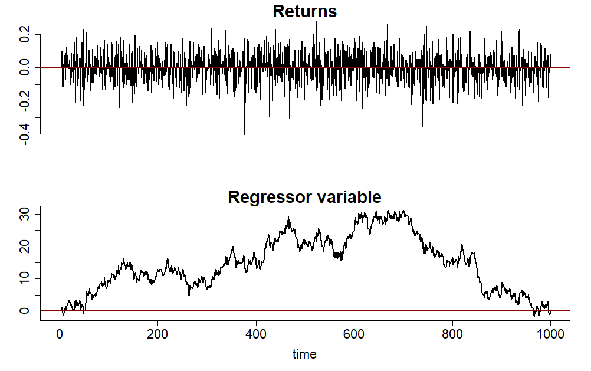
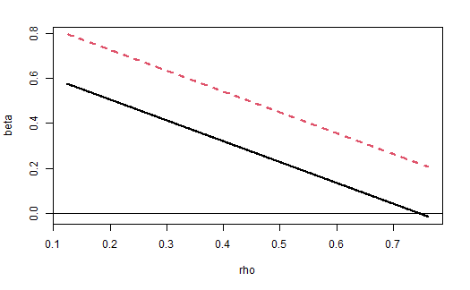

# Efficient Tests of Stock Return Predictability

  

  <i>Simulated Returns with highly persistent Reggressor</i>

Predicting stock returns, especially using financial measures such as the earnings-price ratio (E/P), received considerable academic attention in the 1970s and 1980s. Most research uses ordinary least squares (OLS) regression, with stock returns as the dependent variable against lagged financial predictors. However, their inference based on first-order-asymptotics might be spurious, because the OLS estimator is 2nd order biased, and its t-statistic has a non-normal limit distribution, if the predictor is highly persistent (long-memory) and its innovations are closely correlated with the regression disturbances. The former is a common property of many relevant financial time series.

$$
r_t = \alpha + \beta x_{t-1} + u_t
$$

$$
x_t = \gamma + \sum_{i=1}^{p} \rho_i x_{t-i} + e_t
$$

[Campbell and Yogo (2006)](https://www.sciencedirect.com/science/article/abs/pii/S0304405X05002151) address these limitations by proposing the **Bonferroni Q-test**. This test refines the infeasible uniformly most powerful Q-test by applying the Bonferroni method.

$$
Q(\beta_0, \rho) = \frac{x_0^\mu(r_1 - \beta_0 x_0 - \beta_{ue}(x_1 - \rho x_0)) + \ldots + x_{T-1}^\mu(r_T - \beta_0 x_{T-1} - \beta_{ue}(x_T - \rho x_{T-1}))}{\sigma_u \sqrt{1 - \delta^2} \sqrt{x_0^{\mu 2} + \ldots + x_{T-1}^{\mu 2}}}
$$

## Procedure

The R code implements the testing procedure as described in the paper *Implementing the Econometric Methods in “Efficient Tests of Stock Return Predictability”* (2005) and is divided into several steps:

### Data Preparation
- **Importing Data**: The script imports stock market data from an Excel file using the `readxl` library. It specifically selects rows based on a predefined frequency (`freq`).
- **Variable Definition**: Defines `m` as the log-transformed predictor variable and `y` as the log difference of stock returns.

### Bayes Information Criterion (BIC)
- **Function Definition**: A function is created to calculate the Bayesian Information Criterion (BIC) for AR(p) models. This function evaluates the BIC value, aiding in model selection.
- **Model Selection**: Iterates over different AR(p) models and selects the one with the smallest BIC, determining the optimal number of lags (p) for the AR model.

### Bonferroni Q-test: Part 1
- **Step 1**: Calculates the standard error of β and sets up a data matrix for Augmented Dickey-Fuller (ADF) regression to estimate ψ coefficients.
- **Step 2**: Performs an autoregression on the predictor variable to estimate the standard error of ρ and its variance.
- **Step 3**: Computes the DF-GLS statistic, necessary for unit root testing in the AR(p) model, involving de-meaning the predictor variable and running ADF regression.

### Confidence Interval for the Largest Autoregressive Root
- **Interval Calculation**: Determines the confidence interval for the largest autoregressive root (ρ) using predefined values from Campbell and Yogo (2005).

### Bonferroni Q-test: Part 2
- **Adjusting and Estimating β**: Adjusts the stock returns for estimated ρ values and re-estimates β.
- **90% Confidence Interval**: Calculates the 90% confidence interval for β, incorporating computed standard errors and variance terms. This interval is critical for hypothesis testing regarding the predictor's predictive ability.
- **Graphical Representation**: Plots the confidence intervals against ρ values to visually represent the variable's predictive ability across different ρ values.

## Results Interpretation

At the end of the code, a plot is rendered showing the confidence interval of the OLS estimator as a function of persistence. If this does not include 0 in any case, the null hypothesis can be rejected. If it does, one must weigh how to evaluate the persistence values for which the confidence interval of the OLS estimator includes 0.

  

  <i>OLS estimator's Bonferroni Confidence Intervals as a Function of Rho</i>

