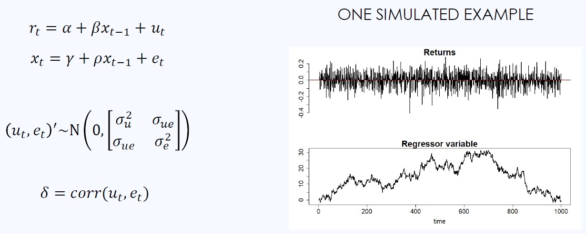

# Efficient Tests of Stock Return Predictability

  

  <i>Regression Model</i>

Predicting stock returns, especially using financial measures such as the earnings-price ratio (E/P), received considerable academic attention in the 1970s and 1980s. Most research uses ordinary least squares (OLS) regression, with stock returns as the dependent variable against lagged financial predictors. However, their inference based on first-order-asymptotics might be spurious, because the OLS estimator is 2nd order biased, and its t-statistic has a non-normal limit distribution, if the predictor is highly persistent (long-memory) and its innovations are closely correlated with the regression disturbances. The former is a common property of many relevant financial time series.

[Campbell and Yogo (2006)](https://www.sciencedirect.com/science/article/abs/pii/S0304405X05002151) address these limitations by proposing the **Bonferroni Q-test**. This test refines the infeasible uniformly most powerful Q-test by applying the Bonferroni method.

## Overview

The R code implements the testing procedure and is divided into several steps:

1. **Bayesian Information Criterion (BIC) calculation**: This block defines the BIC function and uses it to determine the optimal order p of an autoregressive (AR) model by minimizing the BIC on a dataset `ts(m)`. The AR model is then fit using the `dynlm` package.

2. **Intermediate steps for Bonferroni Q-test**: This block performs several intermediate steps in preparation for the Bonferroni Q-test. These steps include estimating the standard error of the slope coefficient, calculating the first-order difference of the predictor variable, setting up a matrix to store lagged differences, and calculating residuals, variances, and covariance, among others.

3. **Bonferroni Q-test**: The final block of code performs the Bonferroni Q-test using the intermediate values calculated in the previous step. The test is used to determine whether the slope coefficient beta of the linear regression is significantly different from 0. This can be used to test the hypothesis that the predictor variable is related to the response variable (stock returns).

## Results Interpretation

The output of the Bonferroni Q-test will help you determine whether the predictor variable is related to the stock returns. If the test indicates a significant relationship, the variable can be considered predictive. Otherwise, it is not predictive. Additionally, a plot is generated to visualize the relationship between different values of rho and beta.

Happy coding and stock return analysis!
